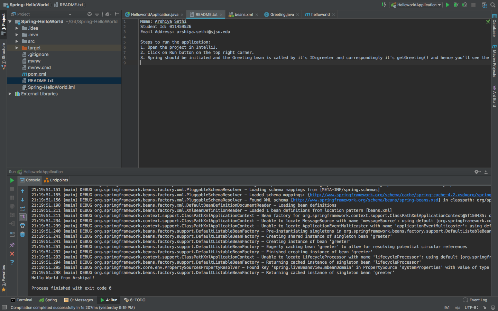

# Spring-HelloWorld

HelloWorld using technologies:

• Spring  
• Beans  
• Interfaces 

Features: 

• Takes the name from beans.xml and displays message "Hello World from Arshiya!!" ny implementing interfaces.

Steps to run the application:

1. Open the project in IntelliJ.
2. Click on Run button on the top right corner.
3. Spring should be initiated and the Greeting bean is called by it's ID:greeter and correspondingly it's getGreeting() and hence you'll see the message "Hello World from Arshiya!!" in the console.

Below are some screenshots demonstrating the application:

### Console showing the message

